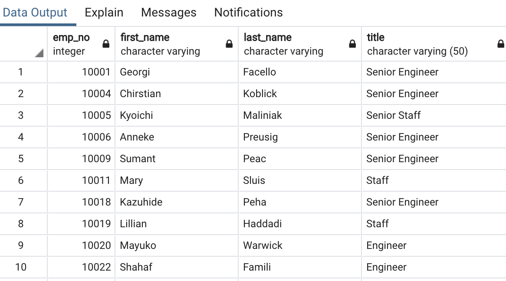
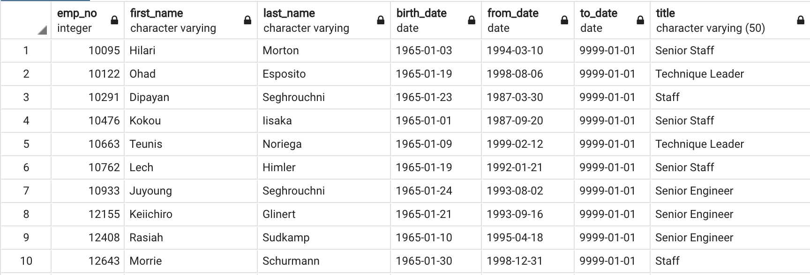

# Pewlett-Hackard-Analysis


## Table of Contents
* [Project title](#project-title)
* [Technologies](#technologies)
* [Overview](#overview)
* [Results](#results)
* [Summary](#summary)


## Project title
Pewlett-Hackard-Analysis

## Technologies
[PostgreSQL](https://www.postgresql.org/download/)

## Overview 
Pewlett Hackard is a large company boasting several thousand employees and it has been around for a long time-- As baby boomers begin to retire at a rapid rate, PH is looking toward the future in two ways: 
1. They are offering retirement package for those who meet certain criteria;
2. They are starting to think about which positions will need to be filled in the near future.

Building a employee database with SQL allows us to figure how who will be retiring in the next few years and how many position they would need to fill and this analysis would be very helpful for the company since it will give the company enough time to prepare and plan for significant changes.

## Results

[(retirement_titles.csv)](https://github.com/Bominkkwon/Pewlett-Hackard-Analysis/blob/main/Data/retirement_titles.csv)

                                     
[(retiring_titles.csv)](https://github.com/Bominkkwon/Pewlett-Hackard-Analysis/blob/main/Data/retiring_titles.csv)


[(unique_titles.csv)](https://github.com/Bominkkwon/Pewlett-Hackard-Analysis/blob/main/Data/unique_titles.csv)


[(mentorship_eligibility.csv)](https://github.com/Bominkkwon/Pewlett-Hackard-Analysis/blob/main/Data/mentorship_eligibilty.csv)

* The most retiring position is Senior Engineer -- the company will need to work on hiring a lot of senior engineers or promoting their non senior engineers to senior engineers and hire non senioe engineers
* The second most retiring position is Senior Staff -- the company will need to hire more or promote staff.
* From the "retirement_titles"chart, we can see those employees who was promoted from a "entry-level" position to a "senior-level" and those who were hired as "senior" -- the company can utilize this information to make their mentorship program more effective.
* Lack of "Technique Leader" mentors who are eligible for its mentorship program may discourage some employees from picking that path or may encourage them to look for a different mentorship program elsewhere. 

## Summary

Pewlett Hackard has 41,380 retirement-eligible employees; the most retiring positions: Senior Engineer and Senior Staff positions need to be filled as the "silver tsunami" begins to make an impact. In general, such "senior-level" positions have higher salaries than those "entry-level" position, so the company can utilize this query:

```sql
SELECT salaries.emp_no, salaries.salary, retirement_titles.title
FROM salaries
INNER JOIN retirement_titles
ON (salaries.emp_no = retirement_titles.emp_no)
ORDER BY salary DESC
```
to see how much they're expecting to spend on "new employees" and how they would go about promoting the current employees and still keep their motivations, etc.
Instead of having a large chunk of their workforce retiring, they want to introduce a mentoring program: experienced and successful employees stepping back into a part-time role instead of retiring completely. Their new role in the company would be as a mentor to the newly hired folks. This query:

```sql
SELECT DISTINCT title, count(title)
from mentorship_eligibility
GROUP BY title
```
shows that very small number of them are actually eligible for such program -- only 1.7% of the total number of "Technique Leader" who are eligible for retirement. Therefore, the company should not completely depend on those "part time" roles and should focus on hiring more people.

